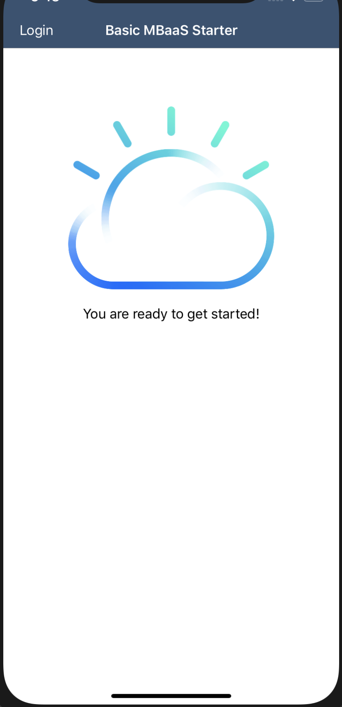

## Basic MBaaS for iOS
Mobile Backend as a Service with Push Notifications and Authentication.

[](https://cloud.ibm.com)
[](https://developer.apple.com/swift/)

### Table of Contents
* [Summary](#summary)
* [Requirements](#requirements)
* [Configuration](#configuration)
* [Run](#run)
* [Next Steps](#next-steps)
* [License](#license)

### Summary

The MBaaS Swift starter kit is an empty project preconfigured with support for [Push Notifications](https://cloud.ibm.com/docs/swift/push/push_notifications.html#push_notifications) and [App ID](https://cloud.ibm.com/docs/swift/authenticate/app_id.html#adding-user-authentication).  These services have been automatically provisioned for you, and you can begin to build out the functionality specific to your usecase.

### Requirements

* iOS 12.0+
* Xcode 10.0
* Swift 4.2+

### Configuration
* [IBM Cloud Mobile services Dependency Management](#ibm-cloud-mobile-services-dependency-management)

#### IBM Cloud Mobile services Dependency Management

The IBM Cloud Mobile services SDK uses [CocoaPods](https://cocoapods.org/) to manage and configure dependencies.

You can install CocoaPods using the following command:

```bash
$ sudo gem install cocoapods
```

If the CocoaPods repository is not configured, run the following command:

```bash
$ pod setup
```

For this starter, a pre-configured `Podfile` has been included. To download and install the required dependencies, run the following command in your project directory:

```bash
$ pod install
```
Open the Xcode workspace: `{APP_Name}.xcworkspace`. Continue to open the `.xcworkspace` file as it contains all the dependencies and configurations.

If you run into any issues during the pod install, it is recommended to run a pod update by using the following commands:

```bash
$ pod update
$ pod install
```

### Run

Click **Product > Run** to start the app in Xcode.  You will see a screen like this:



The application has built in integration points with the Push Notifications and AppID services.

### Next Steps

* Checkout the [Swift Programming Guide](https://cloud.ibm.com/docs/swift/index.html#set_up) to learn more about leveraging the capabilities of the IBM Cloud.

* View the [Push Notifications documentation](https://cloud.ibm.com/docs/swift/push/push_notifications.html#push_notifications)  to learn how to configure

* View the [App ID documentation](https://cloud.ibm.com/docs/swift/authenticate/app_id.html#adding-user-authentication) to add the user authentication method that best serves your application.

### License
This package contains code licensed under the Apache License, Version 2.0 (the "License"). You may obtain a copy of the License at http://www.apache.org/licenses/LICENSE-2.0 and may also view the License in the LICENSE file within this package.
